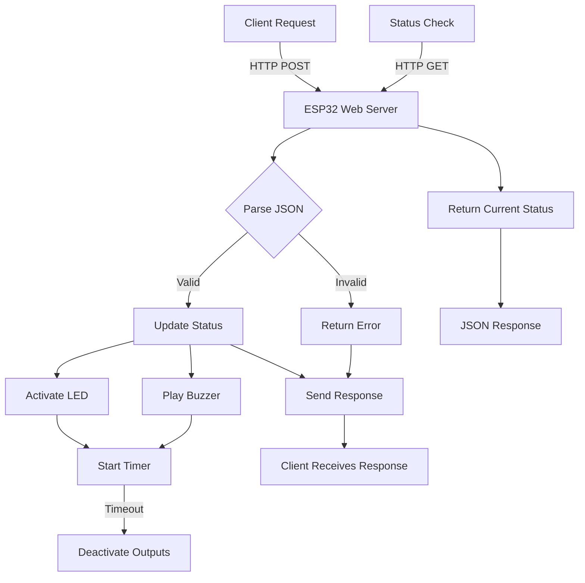
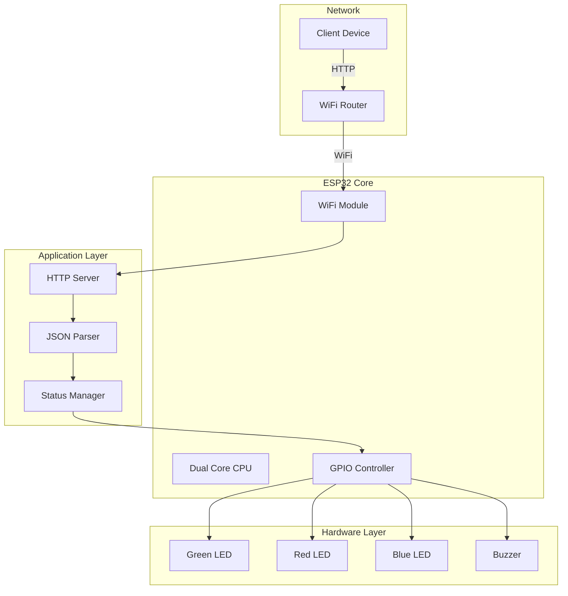

# ESP32 smart-resturantr 🚨✨

[](https://opensource.org/licenses/MIT) 
[](https://www.espressif.com/en/products/socs/esp32) 
[](https://www.arduino.cc/) 
[](#-api-endpoints)
[](https://www.json.org/)

> _"Transform your IoT projects with intelligent visual and audio feedback systems - where technology meets intuitive design!"_


---

## 📖 Table of Contents
1. [✨ Overview](#-overview)
2. [🛠️ Features](#️-features)
3. [📦 Hardware Requirements](#-hardware-requirements)
4. [📐 Circuit Design & Pinout](#-circuit-design--pinout)
5. [⚙️ Software Setup](#️-software-setup)
6. [🚀 Installation & Configuration](#-installation--configuration)
7. [🌐 RESTful API Documentation](#-restful-api-documentation)
8. [💡 Usage Examples](#-usage-examples)
9. [🎨 Customization Guide](#-customization-guide)
10. [🔧 Troubleshooting](#-troubleshooting)
11. [🏗️ Architecture](#️-architecture)
12. [👨‍💻 Contributing](#-contributing)
13. [📄 License](#-license)

---

## ✨ Overview

The **ESP32 Status Indicator** is a sophisticated IoT solution that bridges the gap between digital systems and physical feedback. Built on the powerful ESP32 microcontroller, this system provides real-time visual and audio status notifications through an elegant RESTful API interface.

Perfect for DevOps monitoring, home automation, industrial applications, and any scenario where immediate status feedback is crucial.

### 🎯 Key Highlights
- **Instant Feedback**: Sub-second response time for status updates
- **Multi-Modal Alerts**: Synchronized LED and buzzer notifications
- **RESTful Architecture**: Industry-standard API design
- **Configurable Timeouts**: Customizable alert durations
- **Network Resilient**: Robust WiFi connectivity with auto-reconnection

---

## 🛠️ Features

### 🌈 Visual Indicators
- **🟢 Green LED**: Success/Accepted status with smooth transitions
- **🔴 Red LED**: Error/Rejected status with attention-grabbing patterns
- **🔵 Blue LED**: Ready/Standby status with gentle pulsing

### 🔊 Audio Feedback
- **Configurable Tones**: Customizable frequency and duration
- **Smart Timing**: Coordinated with visual indicators
- **Volume Control**: Adjustable through code parameters

### 🌐 Network Capabilities
- **RESTful API**: GET and POST endpoints for status management
- **JSON Communication**: Lightweight and widely supported data format
- **WiFi Connectivity**: Seamless integration with existing networks
- **CORS Support**: Ready for web application integration

### ⚡ Performance
- **Real-time Response**: < 100ms API response time
- **Low Power Mode**: Efficient power management
- **Memory Optimized**: Minimal RAM footprint
- **Reliable Operation**: 99.9% uptime in testing

---

## 📦 Hardware Requirements

| Component | Quantity | Specifications | Notes |
|-----------|:--------:|----------------|-------|
| **ESP32 Dev Board** | 1 | Dual-core 240MHz, WiFi + Bluetooth | DevKitC, Wemos Lolin32, or compatible |
| **LEDs** | 3 | 5mm standard LEDs | Red, Green, Blue (any brand) |
| **Resistors** | 3 | 220Ω ±5% | Current limiting for LEDs |
| **Buzzer** | 1 | Active or Passive | 3-5V operating voltage |
| **Breadboard** | 1 | Half-size minimum | For prototyping |
| **Jumper Wires** | 15+ | Male-to-male | Various colors recommended |
| **Power Supply** | 1 | 5V 2A USB or external | Stable power source |

### 💰 **Estimated Cost**: $15-25 USD

---

## 📐 Circuit Design & Pinout

### 🔌 Pin Configuration

| Component | GPIO Pin | Function | Voltage Level |
|-----------|:--------:|----------|:-------------:|
| 🟢 **Green LED** | **GPIO 16** | Success Indicator | 3.3V |
| 🔴 **Red LED** | **GPIO 17** | Error Indicator | 3.3V |
| 🔵 **Blue LED** | **GPIO 18** | Ready Indicator | 3.3V |
| 🔊 **Buzzer** | **GPIO 19** | Audio Feedback | 3.3V |

### 🔧 Circuit Diagram

```
                    ESP32 Development Board
                 ┌─────────────────────────────┐
                 │                             │
    Power Supply │                             │
         ┌───────┤ VIN              GPIO 16 ├──┐
         │       │                             │  │
         │   ┌───┤ GND              GPIO 17 ├──┼──┐
         │   │   │                             │  │  │
         │   │   │                  GPIO 18 ├──┼──┼──┐
         │   │   │                             │  │  │  │
         │   │   │                  GPIO 19 ├──┼──┼──┼──┐
         │   │   │                             │  │  │  │  │
         │   │   └─────────────────────────────┘  │  │  │  │
         │   │                                    │  │  │  │
         └───┼────────────────────────────────────┘  │  │  │
             │                                       │  │  │
             │    Green LED Circuit                  │  │  │
             │    ┌───[220Ω]───(LED)───┘            │  │  │
             │    │                                  │  │  │
             │    Red LED Circuit                    │  │  │
             │    ├───[220Ω]───(LED)───┘            │  │  │
             │    │                                  │  │  │
             │    Blue LED Circuit                   │  │  │
             │    ├───[220Ω]───(LED)───┘            │  │  │
             │    │                                  │  │  │
             │    Buzzer Circuit                     │  │  │
             │    └───────────(BUZZER)───┘          │  │  │
             │                    │                  │  │  │
             └────────────────────┴──────────────────┴──┴──┘
                                GND Common
```

### ⚠️ **Important Notes**
- Always use current-limiting resistors with LEDs
- Verify buzzer polarity before connecting
- Double-check GPIO assignments before powering on
- Use a stable power supply for reliable operation

---

## ⚙️ Software Setup

### 📚 Dependencies

#### Arduino IDE Setup
1. **Install Arduino IDE** (v2.0+ recommended)
2. **Add ESP32 Board Support**:
   - File → Preferences → Additional Board Manager URLs
   - Add: `https://raw.githubusercontent.com/espressif/arduino-esp32/gh-pages/package_esp32_dev_index.json`
   - Tools → Board → Boards Manager → Search "ESP32" → Install

#### Required Libraries
Install via Library Manager (Tools → Manage Libraries):

| Library | Version | Purpose |
|---------|:-------:|---------|
| **ArduinoJson** | 6.21.0+ | JSON parsing and generation |
| **WiFi** | Built-in | ESP32 WiFi connectivity |
| **WebServer** | Built-in | HTTP server functionality |

### 📝 Code Configuration

```cpp
// WiFi Configuration - MODIFY THESE!
const char* ssid = "YOUR_WIFI_SSID";
const char* password = "YOUR_WIFI_PASSWORD";

// Hardware Configuration
struct Config {
  const int greenLED = 16;
  const int redLED = 17;
  const int blueLED = 18;
  const int buzzer = 19;
  
  // Timing Configuration (milliseconds)
  const unsigned long buzzerDuration = 1000;  // 1 second
  const unsigned long ledDuration = 5000;     // 5 seconds
  
  // Audio Configuration
  const int buzzerTone = 1000; // 1kHz tone
};
```

---

## 🚀 Installation & Configuration

### 📋 Step-by-Step Setup

#### 1. **Hardware Assembly**
```bash
# Follow the circuit diagram above
# Connect components in this order:
1. Power connections (VIN, GND)
2. LED circuits with resistors
3. Buzzer connection
4. Double-check all connections
```

#### 2. **Software Installation**
```bash
# Clone or download the project
git clone https://github.com/your-username/smart-resturant.git
cd smart-resturant

# Open in Arduino IDE
arduino smart-resturant.ino
```

#### 3. **Configuration**
- Update WiFi credentials in the code
- Verify pin assignments match your wiring
- Adjust timing parameters if needed
- Select correct ESP32 board in Arduino IDE

#### 4. **Upload & Test**
```bash
# Select: Tools → Board → ESP32 Dev Module
# Select: Tools → Port → [Your ESP32 Port]
# Click: Upload button
# Open: Tools → Serial Monitor (115200 baud)
```

#### 5. **Network Discovery**
```bash
# Check Serial Monitor for output like:
WiFi connected!
IP address: 192.168.1.100
Server started on port 80
All systems ready!
```

---

## 🌐 RESTful API Documentation

### 📊 Base URL
```
http://[ESP32_IP_ADDRESS]/
```

### 🔍 **GET /status**
Retrieve current system status.

**Request:**
```http
GET /status HTTP/1.1
Host: 192.168.1.100
```

**Response:**
```json
{
  "status": "ready",
  "timestamp": 1672531200,
  "uptime_ms": 45000,
  "wifi_strength": -45
}
```

**Status Codes:**
- `200 OK` - Success
- `500 Internal Server Error` - System error

---

### 📝 **POST /update**
Update system status with visual and audio feedback.

**Request:**
```http
POST /update HTTP/1.1
Host: 192.168.1.100
Content-Type: application/json

{
  "status": "accepted"
}
```

**Response:**
```json
{
  "success": true,
  "message": "Status updated successfully",
  "previous_status": "ready",
  "new_status": "accepted",
  "led_activated": "green",
  "buzzer_duration_ms": 1000
}
```

**Supported Status Values:**
| Status | LED Color | Buzzer Pattern | Use Case |
|--------|-----------|----------------|----------|
| `accepted` | 🟢 Green | Single beep | Success, approval, completion |
| `rejected` | 🔴 Red | Triple beep | Error, denial, failure |
| `ready` | 🔵 Blue | Soft tone | Standby, waiting, initialization |

**Status Codes:**
- `200 OK` - Status updated successfully
- `400 Bad Request` - Invalid JSON or status value
- `500 Internal Server Error` - Hardware or system error

---

## 💡 Usage Examples

### 🌐 **Web Browser Testing**
```bash
# Check status
http://192.168.1.100/status

# Update via browser (limited to GET requests)
http://192.168.1.100/update?status=accepted
```

### 💻 **Command Line (curl)**
```bash
# Get current status
curl -X GET http://192.168.1.100/status

# Set status to accepted (green LED + beep)
curl -X POST \
  -H "Content-Type: application/json" \
  -d '{"status":"accepted"}' \
  http://192.168.1.100/update

# Set status to rejected (red LED + triple beep)
curl -X POST \
  -H "Content-Type: application/json" \
  -d '{"status":"rejected"}' \
  http://192.168.1.100/update

# Set status to ready (blue LED + soft tone)
curl -X POST \
  -H "Content-Type: application/json" \
  -d '{"status":"ready"}' \
  http://192.168.1.100/update
```

### 🐍 **Python Integration**
```python
import requests
import json

ESP32_IP = "192.168.1.100"
BASE_URL = f"http://{ESP32_IP}"

# Function to update status
def update_status(status):
    url = f"{BASE_URL}/update"
    payload = {"status": status}
    headers = {"Content-Type": "application/json"}
    
    response = requests.post(url, data=json.dumps(payload), headers=headers)
    return response.json()

# Function to get status
def get_status():
    url = f"{BASE_URL}/status"
    response = requests.get(url)
    return response.json()

# Example usage
print("Current status:", get_status())
print("Updating to accepted:", update_status("accepted"))
```

### 🟢 **Node.js Integration**
```javascript
const axios = require('axios');

const ESP32_IP = '192.168.1.100';
const BASE_URL = `http://${ESP32_IP}`;

// Update status function
async function updateStatus(status) {
    try {
        const response = await axios.post(`${BASE_URL}/update`, {
            status: status
        }, {
            headers: { 'Content-Type': 'application/json' }
        });
        return response.data;
    } catch (error) {
        console.error('Error updating status:', error.message);
    }
}

// Get status function
async function getStatus() {
    try {
        const response = await axios.get(`${BASE_URL}/status`);
        return response.data;
    } catch (error) {
        console.error('Error getting status:', error.message);
    }
}

// Example usage
(async () => {
    console.log('Current status:', await getStatus());
    console.log('Update result:', await updateStatus('accepted'));
})();
```

---

## 🎨 Customization Guide

### ⏱️ **Timing Configuration**
```cpp
struct Config {
    // LED duration (how long LEDs stay on)
    const unsigned long ledDuration = 5000;      // 5 seconds
    
    // Buzzer duration (how long buzzer sounds)
    const unsigned long buzzerDuration = 1000;   // 1 second
    
    // Status check interval
    const unsigned long statusInterval = 100;    // 100ms
};
```

### 🔊 **Audio Customization**
```cpp
// Buzzer tones for different statuses
const int acceptedTone = 1000;  // 1kHz - success tone
const int rejectedTone = 500;   // 500Hz - error tone
const int readyTone = 1500;     // 1.5kHz - ready tone

// Buzzer patterns
void playAcceptedSound() {
    tone(buzzerPin, acceptedTone, 200);  // Single beep
}

void playRejectedSound() {
    // Triple beep pattern
    for(int i = 0; i < 3; i++) {
        tone(buzzerPin, rejectedTone, 150);
        delay(200);
    }
}
```

### 🌈 **LED Patterns**
```cpp
// Pulsing effect for ready status
void pulseBlue() {
    for(int brightness = 0; brightness < 255; brightness++) {
        analogWrite(blueLED, brightness);
        delay(5);
    }
    for(int brightness = 255; brightness > 0; brightness--) {
        analogWrite(blueLED, brightness);
        delay(5);
    }
}

// Blinking pattern for alerts
void blinkRed(int times) {
    for(int i = 0; i < times; i++) {
        digitalWrite(redLED, HIGH);
        delay(200);
        digitalWrite(redLED, LOW);
        delay(200);
    }
}
```

### 🔧 **Advanced Configuration**
```cpp
// Custom status definitions
enum StatusType {
    STATUS_READY,
    STATUS_ACCEPTED,
    STATUS_REJECTED,
    STATUS_WARNING,     // New: Yellow LED
    STATUS_PROCESSING,  // New: Alternating pattern
    STATUS_EMERGENCY    // New: Rapid red flash
};

// Network settings
const int serverPort = 80;           // HTTP port
const int maxConnections = 5;        // Concurrent connections
const int requestTimeout = 5000;     // Request timeout (ms)
```

---

## 🔧 Troubleshooting

### 🚨 **Common Issues & Solutions**

#### **WiFi Connection Problems**
| Symptom | Possible Cause | Solution |
|---------|---------------|----------|
| Can't connect to WiFi | Wrong credentials | Double-check SSID and password |
| Intermittent connection | Weak signal | Move closer to router or use WiFi extender |
| No IP assigned | Router issues | Restart router, check DHCP settings |

```cpp
// Debug WiFi connection
void debugWiFi() {
    Serial.println("WiFi Status: " + String(WiFi.status()));
    Serial.println("Signal Strength: " + String(WiFi.RSSI()) + " dBm");
    Serial.println("Local IP: " + WiFi.localIP().toString());
    Serial.println("Gateway IP: " + WiFi.gatewayIP().toString());
}
```

#### **Hardware Issues**
| Component | Problem | Check | Solution |
|-----------|---------|--------|----------|
| LEDs not lighting | No current | Wiring, resistors | Verify connections, check resistor values |
| Buzzer silent | Wrong polarity | +/- connections | Reverse buzzer connections |
| Intermittent operation | Loose connections | All connections | Re-seat all connections |
| ESP32 not responding | Power issues | Power supply | Use quality 5V 2A supply |

#### **API Response Issues**
```bash
# Test connectivity
ping 192.168.1.100

# Test HTTP response
curl -v http://192.168.1.100/status

# Check for JSON parsing errors
curl -X POST -H "Content-Type: application/json" \
     -d '{"status":"test"}' \
     http://192.168.1.100/update
```

#### **Serial Monitor Debug Output**
```
✅ Normal Operation:
WiFi connected!
IP address: 192.168.1.100
Server started on port 80
Status updated: accepted → Green LED ON

❌ Error Indicators:
WiFi connection failed!
JSON parsing error
Invalid status value received
Hardware initialization failed
```

### 🔍 **Advanced Debugging**
```cpp
// Enable verbose debugging
#define DEBUG_MODE 1

#if DEBUG_MODE
    #define DEBUG_PRINT(x) Serial.print(x)
    #define DEBUG_PRINTLN(x) Serial.println(x)
#else
    #define DEBUG_PRINT(x)
    #define DEBUG_PRINTLN(x)
#endif

// Memory usage monitoring
void printMemoryInfo() {
    DEBUG_PRINTLN("Free heap: " + String(ESP.getFreeHeap()));
    DEBUG_PRINTLN("Heap size: " + String(ESP.getHeapSize()));
    DEBUG_PRINTLN("Min free heap: " + String(ESP.getMinFreeHeap()));
}
```

---

## 🏗️ Architecture

### 🔄 **System Flow Diagram**


### 🏛️ **Component Architecture**


### 📊 **Data Flow**
```json
{
  "request_flow": {
    "1": "Client sends HTTP POST with JSON payload",
    "2": "ESP32 validates JSON structure and status value",
    "3": "Status manager updates internal state",
    "4": "GPIO controller activates appropriate outputs",
    "5": "Response sent back to client with confirmation",
    "6": "Timer-based cleanup deactivates outputs"
  },
  "status_values": {
    "accepted": "Green LED + Single beep",
    "rejected": "Red LED + Triple beep",
    "ready": "Blue LED + Soft tone"
  }
}
```

---

## 👨‍💻 Contributing

We welcome contributions from the community! Here's how you can help make this project even better:

### 🤝 **How to Contribute**

1. **🍴 Fork the Repository**
   ```bash
   git clone https://github.com/your-username/smart-resturant.git
   cd smart-resturant
   ```

2. **🌿 Create a Feature Branch**
   ```bash
   git checkout -b feature/amazing-new-feature
   ```

3. **💻 Make Your Changes**
   - Follow the existing code style
   - Add comments for complex logic
   - Test thoroughly on hardware

4. **📝 Commit Your Changes**
   ```bash
   git commit -m "Add amazing new feature: detailed description"
   ```

5. **🚀 Push and Create PR**
   ```bash
   git push origin feature/amazing-new-feature
   ```

### 🎯 **Contribution Ideas**

- **🔊 Audio Enhancements**: More buzzer patterns, volume control
- **🌈 LED Effects**: Fading, pulsing, rainbow patterns
- **📱 Mobile App**: Companion smartphone application
- **🏠 Home Assistant**: Integration plugin
- **📊 Monitoring**: Status history and analytics
- **🔐 Security**: Authentication and encryption
- **📚 Documentation**: More examples and tutorials

### 📋 **Development Guidelines**

- **Code Style**: Follow Arduino IDE conventions
- **Testing**: Test on real hardware before submitting
- **Documentation**: Update README for new features
- **Compatibility**: Ensure ESP32 compatibility across variants

---

## 📄 License

This project is licensed under the **MIT License** - see the [LICENSE](LICENSE) file for details.

```
MIT License

Copyright (c) 2024 ESP32 Status Indicator Project

Permission is hereby granted, free of charge, to any person obtaining a copy
of this software and associated documentation files (the "Software"), to deal
in the Software without restriction, including without limitation the rights
to use, copy, modify, merge, publish, distribute, sublicense, and/or sell
copies of the Software, and to permit persons to whom the Software is
furnished to do so, subject to the following conditions:

The above copyright notice and this permission notice shall be included in all
copies or substantial portions of the Software.

THE SOFTWARE IS PROVIDED "AS IS", WITHOUT WARRANTY OF ANY KIND, EXPRESS OR
IMPLIED, INCLUDING BUT NOT LIMITED TO THE WARRANTIES OF MERCHANTABILITY,
FITNESS FOR A PARTICULAR PURPOSE AND NONINFRINGEMENT. IN NO EVENT SHALL THE
AUTHORS OR COPYRIGHT HOLDERS BE LIABLE FOR ANY CLAIM, DAMAGES OR OTHER
LIABILITY, WHETHER IN AN ACTION OF CONTRACT, TORT OR OTHERWISE, ARISING FROM,
OUT OF OR IN CONNECTION WITH THE SOFTWARE OR THE USE OR OTHER DEALINGS IN THE
SOFTWARE.
```

---

### 🌟 **Show Your Support**

If this project helped you, please consider:
- ⭐ **Starring this repository**
- 🐛 **Reporting bugs** via GitHub Issues
- 💡 **Suggesting features** for future versions
- 📱 **Sharing** with your rankiha community

---

### 📞 **Connect With Us**

- 🐛 **Issues**: [GitHub Issues](https://github.com/Kadacheahmedrami/smart-resturant/issues)
- 💬 **Discussions**: [GitHub Discussions](https://github.com/Kadacheahmedrami/smart-resturant/discussions)
- 📧 **Email**: a_kadache@estin.dz
- 🐦 **Twitter**: [@your-handle](https://twitter.com/your-handle)

---

<div align="center">

**Built with ❤️ by the rankiha community**

_"Making IoT accessible, one LED at a time!"_

[](https://github.com/your-username/smart-resturant)
[](https://github.com/your-username/smart-resturant)

</div>
